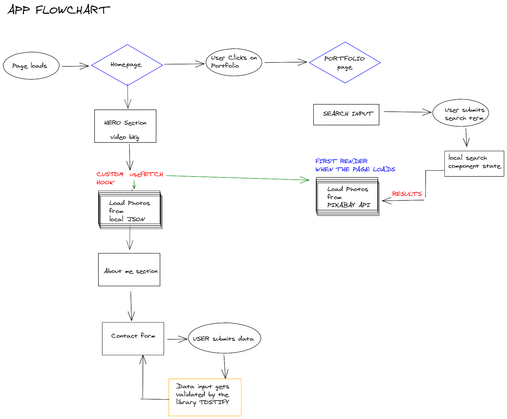
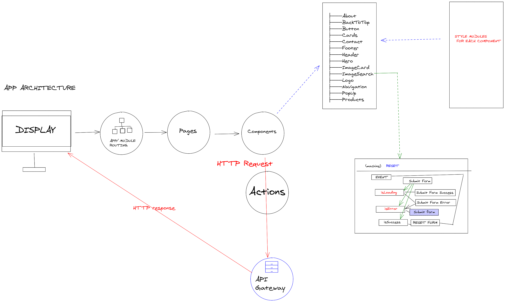

## About this project
- Fetch photos and some data from the Pixabay API.  
   -- turning it into a component  
   -- looping through all the images  
   -- out-put them into cards    
   
- Search component whre you can put a search element.   
If it doesn't exist, it will display: *"No Images found"*

## Languages
React | Tostify | Pixabay 

# Clone

If you wish to run the project locally you will need to setup the enviroment first.

- clone repo

- cd client

- npm install

- npm start

2. Log into [https://pixabay.com/api/docs/]
and create a user (free account)

3. Create an .env file in the folder client 

* │       │   ├───public
* │       │   ├───src
* │       │   ├───env
* │       │   ├───package.json

and put your key there : REACT_APP_PIXABAY_API_KEY=xxxxxxxxxxxxxxx

4.Ready, go !

5. Live version on [https://james-brown-react.netlify.app/]

# Project tree 
└───src  
    ├───components  
    │   ├───About  
    │   ├───BackToTop  
    │   ├───Button  
    │   ├───Cards  
    │   ├───Contact  
    │   ├───Footer  
    │   ├───Header  
    │   ├───Hero  
    │   ├───ImageCard  
    │   ├───ImageSearch  
    │   ├───Logo  
    │   ├───Navigation  
    │   ├───PopUp  
    │   ├───Products  
    │   └───Section  
    └───pages  
        ├───Home  
        ├───Portfolio  
        └───Repertoire  

**APP FLOWCHART**

 

___ 

 

**APP ARCHITECTURE**  

 

___ 

 
